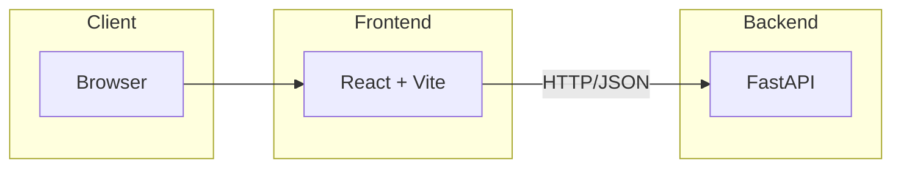
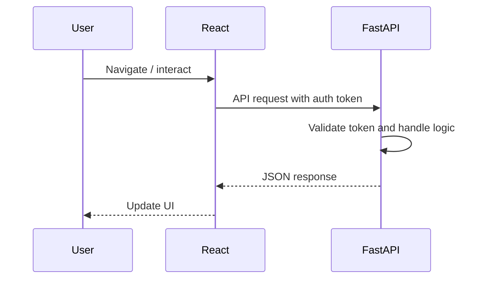

# Architecture Overview

This document describes the high level architecture of the project and the typical flow between the components.

## System Diagram

The React application communicates with the FastAPI backend using JSON over HTTP. During development the Vite dev server proxies API requests to the backend.

## Request Flow

## Key Components

- **Frontend**: Located in `frontend/`, built with React and TypeScript.
- **Backend**: Located in `backend/`, built with FastAPI. Authentication is handled using middleware based on Firebase tokens.
- **Makefile**: Provides commands for installing dependencies and running each part.

Further details on running the project and conventions can be found in the main [README](../README.md).
